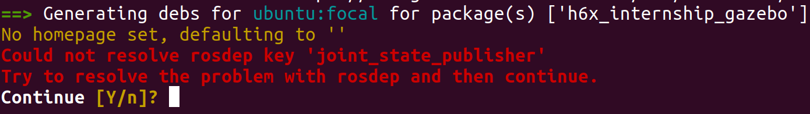

# FAQ

## How does it work?

Some of you may already know, but just following [this official documentation](https://docs.ros.org/en/galactic/How-To-Guides/Building-a-Custom-Debian-Package.html) cannot build private ros2 packages because it cannot resolve dependencies of private packages. The following image is the result of running `bloom-generate rosdebian` in `h6x_internship_gazebo` package. Even if you continue this, bloom-generate cannot resolve this dependency problem. This seems to be because `bloom-generate` tries to resolve dependency with `rosdep`, and rosdep keys doesn't contain any of your private packages.

To solve this problem, this `ros2_deb_builder` adds your private packages to rosdep keys manually. This is done in [update-rosdep.bash](../script/update-rosdep.bash). This script creates `/etc/ros/rosdep/sources.list.d/50-my-packages.list` and it references [my_rosdep.yaml](../ws_galactic/my_rosdep.yaml), which contains the information about your private packages.

### Order of building packages

However, just adding your private packages to rosdep keys still cannot solve the problem yet. You need to **build, generate deb file, and install it in order from the lowest dependency.** If the buid is done in the correct order, `bloom-generate` can always resolve rosdep key because the required packages are already installed in your machine.

Then how can we know the order of dependencies? This sounds a bit complicated, but fortunately, `colcon` command can solve this problem.

`colcon list -tn` lists the names of packages in the topological ordering, and this is what we need to follow to build packages. [generate-deb.bash](../script/generate-deb.bash) uses this list to build.

## How does the name change from ros2 package to debian package?

After building debian packages, the name of the package changes. If the name of your ros2 package is `h6x_internship_gazeo`, then the name of debian package will be `ros-galactic-h6x-internship-gazebo`.

This rule may not be perfect, but it seems like the name changes as:

- `ros-{ros2-version-name}` prefix is added
- `"_"` becomes `"-"`
- Upper case becomes lower case

## How can I set version number of debian package?

Version number of debian package is important, because `apt-get upgrade` command ugrades the packages of which newer version is available. 

Actually, setting version number of deiban package is simple. The version number in `package.xml` of your ros2 package is used to create debian package.
